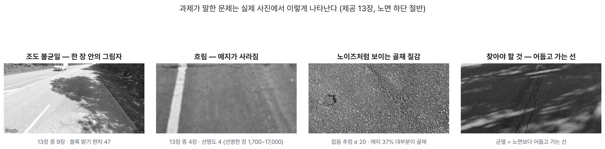
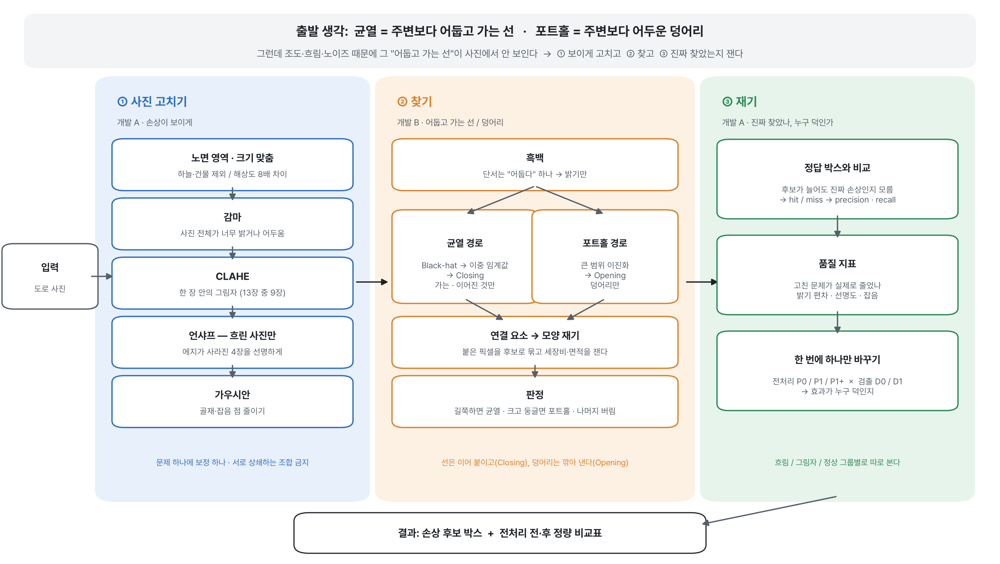
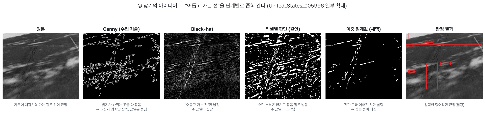

# PBL 모듈 1 - 1차 과제수행계획서

> 저품질 도로 영상의 품질 개선 및 손상(균열·포트홀) 후보 영역 추출 · 제출 2026-10-06(월)
> 근거 표기: `[PBL]` 과제 설명서 / `[2-1]` 등 수업 슬라이드 / `[표1]` 제공 13장 실측 / `[RDD]` 공개 데이터셋 분석 / `[사전실험]` 우리 팀 사전 실험 / `[육안]` 사진 관찰

## 1. 조 정보

| 조명 | (미정) |
|---|---|
| 조원 | ① 황승준 (20012642) ② (미정) ③ (미정) |

---

## 2. 아이디어

> 이 장은 **"왜 그렇게 생각했는가"**를 중심으로 쓴다. 각 결정마다 **관찰 → 그래서 → 결정**의 순서로 적는다.

### 2-1. 문제를 어떻게 봤나 — 과제의 문제가 실제 사진에서 어떻게 나타나는가

과제는 문제를 "조도 불균일·노이즈·흐림" 세 가지로 준다 `[PBL]`. 그런데 이름만으로는 무엇을 해야 할지 정할 수 없어서, **제공 13장을 직접 재 봤다** `[표1]`.



| 과제가 말한 문제 | 재 보니 실제로는 | 그래서 생각한 것 |
|---|---|---|
| 조도 불균일 | 사진 전체가 밝거나 어두운 경우는 각 1장뿐. **13장 중 9장은 한 장 안에서** 그림자/양지가 갈림 | 사진 전체에 같은 보정을 걸면 안 된다. **영역마다** 따로 봐야 한다 |
| 흐림 | 4장은 선명도(Laplacian 분산)가 3~6으로, 선명한 장(1,700~17,000)의 수백분의 1. 에지가 거의 없음 | 이 4장은 아무 검출기로도 0개가 나온다. **선명하게 만드는 단계가 따로** 필요하다 |
| 노이즈 | 랜덤 잡음보다 **아스팔트 골재 질감**이 주범. 에지 비율 1위(37%) 사진은 손상이 아니라 골재 때문 | 에지·후보 "수"가 늘어도 좋아진 게 아닐 수 있다. **진짜 손상을 찾았는지 따로 재야** 한다 |
| (추가) 해상도 | 512px ~ 4040px, 8배 차이 | 같은 크기의 필터가 사진마다 다르게 먹힌다. **크기를 먼저 맞춰야** 한다 |

그리고 찾아야 할 대상을 눈으로 보고 한 문장으로 정의했다 `[육안]`.

> **균열 = 주변보다 어둡고 가는 선 · 포트홀 = 주변보다 어두운 덩어리**

이 문장이 아래 모든 설계의 출발점이다. 그리고 문제를 이렇게 다시 정리했다.

> **문제의 핵심 = 조도·흐림·노이즈 때문에 그 "어둡고 가는 선"이 사진에서 안 보인다는 것.**

### 2-2. 프로세스를 이렇게 잡은 아이디어



**① 왜 "고치기 → 찾기 → 재기" 세 덩어리로 나눴나**

- 관찰: 문제는 두 종류다. 조도·흐림·노이즈는 **사진의 문제**이고, "어둡고 가는 선"은 **찾을 대상의 문제**다.
- 그래서: 사진을 고치는 일과 대상을 찾는 일을 분리했다. 분리해야 과제가 요구하는 **"전처리 전·후 비교"**가 가능하다. 같은 검출기에 고친 사진과 안 고친 사진을 넣어 보면 차이가 곧 전처리 효과다.
- 그리고: 숫자가 늘었다고 좋아진 게 아니다(골재 사진). 그래서 **진짜 손상을 찾았는지 재는 단계**를 따로 뒀다.

**② 왜 고치기를 이 순서로 했나** — 노면 영역·크기 맞춤 → 감마 → CLAHE → 언샤프(흐린 사진만) → 가우시안

| 순서 | 이유 |
|---|---|
| 노면 영역·크기 맞춤이 **맨 앞** | 뒤의 모든 필터 크기·임계값이 이 스케일을 전제로 한다. 하늘·건물이 섞이면 지표도 노면을 반영하지 못한다 (India_002374: 전체 밝기 139 vs 노면 75) |
| 밝기(감마) → 국소 대비(CLAHE) | 큰 범위부터 작은 범위로. 전체 밝기를 먼저 맞춰야 CLAHE가 영역별 차이에만 집중한다 |
| 언샤프 → 가우시안 | 흐림 보정은 노이즈 제거보다 **먼저**. 반대로 하면 가우시안이 흐리게 만든 걸 샤프닝이 다시 세우는, 서로 상쇄하는 조합이 된다 |
| 언샤프는 **흐린 사진만** | 선명한 사진에 걸면 골재 질감까지 날카로워져 가짜 에지가 급증한다 (충돌 C4) |

원칙: **문제 하나에 보정 하나.** 같은 문제에 보정을 여러 개 겹치면 효과가 누구 덕인지 가릴 수 없다.

**③ 왜 찾기를 "균열 경로 / 포트홀 경로" 두 갈래로 나눴나**

- 관찰: 균열은 **가는 선**, 포트홀은 **덩어리**로 모양이 정반대다.
- 그래서: 같은 처리로는 둘 다 잡을 수 없다. 선은 끊긴 곳을 **이어 붙여야** 하고(Closing), 덩어리는 가는 잡음을 **깎아 내야** 한다(Opening). 경로를 둘로 나눴다.

**④ 왜 찾기를 "표시 → 묶기 → 재기 → 판정" 순서로 했나**

- 관찰: 컴퓨터에게 사진은 숫자 표일 뿐이고, "균열"이라는 개념을 모른다.
- 그래서: 의심스러운 픽셀을 표시하고 → 붙은 것끼리 묶어 후보로 만들고 → 그 모양을 숫자로 재서 → 정의("가는 선", "덩어리")에 맞는지 판정한다. **사람의 정의를 숫자 규칙으로 옮기는 순서**다.

**⑤ 왜 재기를 "정답 박스 비교 + 한 번에 하나만 바꾸기"로 했나**

- 관찰: 과제가 요구하는 에지 수·후보 수 `[PBL]`는 그 자체로 좋고 나쁨을 말해 주지 않는다.
- 그래서: 손상마다 정답 박스를 두고 후보가 걸리는지(hit/miss)로 precision·recall을 잰다. 균열은 가늘어서 겹친 면적(IoU)으로 재면 부당하게 낮게 나오므로 **박스에 걸치면 hit**으로 본다.
- 그리고: 효과가 누구 덕인지 가리려고 **한 번에 하나만** 바꾼다 (전처리 P0/P1/P1+ × 검출 D0/D1, 2-5절). 흐린/그림자/정상 사진은 **그룹별로** 본다. 전체 평균만 보면 효과가 서로 상쇄된다.

**⑥ 왜 1차는 고정 순서, 최종은 조건 분기인가**

- 1차: 사진 그룹(흐림/그림자/정상)을 **미리 손으로 나눠** 고정 순서로 돌린다. 먼저 "무엇이 어디서 실패하는지"를 숫자로 본다.
- 최종: 사진 상태를 재서(선명도, 밝기 편차 등) **필요한 보정만 켜는** 조건 분기로 바꾼다. 분기 기준값은 데이터로 정해야 하므로 1차 결과를 보고 정한다.

### 2-3. 각 단계에 이 기술을 쓰려는 아이디어

#### (1) 사진 고치기 — 개발 A

| 기술 | 문제 (관찰) | 생각 | 근거 |
|---|---|---|---|
| **노면 영역** (하단 절반) | 하늘·건물·나무가 에지와 지표를 오염 | 노면만 보자 | `[표1]` |
| **리사이즈** (긴 변 1024) | 해상도 8배 차이 | 필터 크기가 모든 사진에서 같은 의미가 되게 | `[표1]` |
| **감마 보정** | 전체 과노출·저조도 (각 1장) | 밝기 곡선을 조정해 전체 밝기를 맞춘다 | 수업 `[2-1]` |
| **CLAHE** | 한 장 안의 그림자 (9/13장) — **가장 흔한 문제** | 영역마다 따로 대비를 편다. 수업의 히스토그램 평활화는 사진 전체에 히스토그램 하나라 그림자 쪽과 양지 쪽을 동시에 못 살린다 | `[표1]` `[2-1]` |
| **언샤프 마스킹** | 흐린 4장은 에지 0.04~0.6% → 검출 0개 | 흐린 성분을 빼서 경계를 세운다. 흐린 사진에만 적용 | `[표1]` |
| **가우시안** | 골재·잡음 점 | 기준선으로 사용. 단 가는 균열도 지울 수 있어(C1) 2차에 median/bilateral과 비교 | 수업 `[2-1]` |

#### (2) 찾기 — 개발 B

> 출발 문장 **"균열 = 주변보다 어둡고 가는 선"**을 한 단어씩 기술로 옮겼다.
> **어두운** 것만(흑백) → **가는** 것만(Black-hat) → **이어진** 것만(이중 임계값) → 묶어서(연결 요소) → 재고(세장비·면적) → **선**이면 균열



| 기술 | 문제 (관찰) | 생각 | 근거 |
|---|---|---|---|
| **흑백 변환** | — | 손상을 설명할 때 색이 안 나온다. 단서는 "어둡다" 하나 → 밝기만 남긴다 | `[사전실험]` 밝기 채널 AUC 0.62 vs 색 채널 0.45~0.49 |
| **D0: Canny → Closing** | 비교 기준이 필요 | "수업 기술만으로 어디까지 되나"의 기준점. 과제의 "에지 수" 비교에도 필요 | 수업 `[3-1]` |
| **Black-hat** (커널 7) | Canny는 밝기가 바뀌는 곳을 다 잡아 그림자·차선도 잡는다. 균열의 조건 "어두운 선"을 쓰지 않는다 | 어두운 가는 선을 메운 사진과 원본의 차이를 구하면 **어둡고 가는 것만** 남는다. 커널은 균열 폭(2~3px)보다 크고 그림자 띠보다 작게 | `[사전실험]` 커널 15는 그림자 띠까지 잡음. 수업의 닫힘 `[2-1]`으로 구성 |
| **이중 임계값** | 픽셀마다 따로 판단하는 방식(adaptive threshold)은 흐린 균열 부분은 끊고 진한 잡음 점은 남겨, 균열이 조각났다 | 균열은 **진한 부분과 흐린 부분이 이어진 선**이다. 진한 곳을 씨앗으로 삼고, 씨앗과 **이어진** 흐린 곳만 살린다. 기준은 사진마다 "상위 3%"로 정한다 (Black-hat 값 범위가 사진마다 수십 배 다름) | `[사전실험]` 구분력 +0.09 → +0.23 (3-4절). 수업 Canny의 이중 임계값 `[3-1]` 응용 |
| **Closing** (3) | 남은 작은 틈 | 균열을 잇는다. 너무 크면(5) 그림자 조각끼리 붙어 가짜 균열이 된다 | 수업 `[2-1]` |
| **포트홀: 큰 범위 이진화 → Opening** | 포트홀은 선이 아니라 덩어리 | 넓은 범위 평균보다 어두운 곳을 찾고, Opening으로 가는 것을 깎아 덩어리만 남긴다 | 수업 `[2-1]`. 사전 실험에서 부족 → 2차 개선 대상 |
| **연결 요소** | 흰 픽셀은 점의 모임일 뿐 | 붙은 픽셀끼리 묶어 "후보 하나"로 다룬다 | 수업 `[2-1]` |
| **세장비 (기울인 사각형 기준)** | "가는 선"을 숫자로 말해야 판정할 수 있다 | 긴 변 ÷ 짧은 변. 똑바로 선 사각형으로 재면 대각선 균열이 정사각형처럼 보이므로 **기울인** 사각형으로 잰다 | |
| **판정 규칙** | 표시 단계는 넉넉하게 잡아서 후보 대부분이 잡음 | 세장비 ≥ 3 → 균열 / 크고 둥글면 → 포트홀 / 너무 작거나 화면 위쪽 끝(원경 차량·인도)이면 버림 | `[RDD]` 가로 균열 세장비 중앙값 5.0, `[사전실험]` 3이 2·4보다 나음 |

**시도했지만 버린 아이디어** `[사전실험]`

| 아이디어 | 생각 | 버린 이유 |
|---|---|---|
| 방향 있는 막대 커널 | "선"만 남기면 조각이 이어지고 그림자가 빠질 것 | 실제 균열은 구불구불해서 곧은 막대가 맞지 않아 진짜 균열까지 지워짐 |
| 가까운 조각 묶기 | 조각을 하나로 묶으면 길쭉해질 것 | 주변 잡음까지 붙어 오히려 덜 길쭉해짐 |

#### (3) 재기 — 개발 A

| 기술 | 문제 (관찰) | 생각 |
|---|---|---|
| **품질 지표** (노면 밝기 평균·편차, 포화 비율, 선명도, 잡음 σ) | 전처리가 의도한 문제를 실제로 줄였나? | 조도·흐림·노이즈 각각에 숫자 하나를 대응시킨다 |
| **hit/miss → precision·recall** | 에지·후보 수가 늘어도 진짜 손상인지 모름 | 정답 박스와 맞춰 봐야 판정할 수 있다 |
| **검출 지표** (에지 수, 후보 수·면적, 처리 시간) | 과제 요구 항목 `[PBL]` | 그대로 기록하되, 위 정확도와 함께 해석한다 |

### 2-4. 예상되는 문제점 — "다 넣으면 좋아진다"가 아닌 이유

| # | 충돌 | 가설 | 확인할 사진 |
|---|---|---|---|
| C1 | 노이즈 제거 ↔ 균열 보존 | 가우시안을 세게 하면 잡음은 줄지만 가는 균열도 사라진다 | Japan_001959(질감), United_States_005996(가는 균열) |
| C2 | CLAHE ↔ 노이즈·그림자 | 어두운 영역 대비를 키우면 숨은 잡음과 **그림자 띠**도 진해져 가짜 균열이 늘 수 있다 | Norway_009625(저조도), United_States_005996(나무 그림자) |
| C3 | Closing ↔ 정확도 | 끊긴 균열은 잇지만 그림자·골재 조각도 이어 가짜 덩어리를 만든다 | Japan_001959, United_States_005996 |
| C4 | 샤프닝 ↔ 노이즈 | 흐린 사진은 살리지만 질감 사진에 걸면 가짜 에지가 급증한다 → 흐린 사진에만 거는 이유 | 흐림 4장 vs Japan_001959 |
| C5 | Black-hat vs Canny | Black-hat은 밝은 에지(차선·반사)를 덜 잡아 precision↑, 대신 밝은 테두리의 손상은 놓칠 수 있음 | Japan_010993(반사), China_MotorBike_002159(과노출) |

C3는 사전 실험에서 이미 확인됐다 (Closing 5 → 3으로 줄인 이유). 나머지 가설의 맞고 틀림이 2차 계획서와 보고서 "결과 분석"의 본문이 된다 `[PBL]`.

### 2-5. 비교 기준

- **기준점**: 모든 수치는 P0(무처리) 대비 변화량
- **조건** (1차 기간): 3 × 2 = 6가지

| | D0 (Canny) | D1 (Black-hat + 이중 임계값) |
|---|---|---|
| **P0** 무처리 | 기준점 | 검출기 효과 |
| **P1** 수업 기술 (노면 영역·리사이즈·감마·가우시안) | 수업 전처리 효과 | |
| **P1+** P1 + CLAHE + 언샤프(흐린 사진만) | 외부 전처리 효과 | **최종 후보** |

- P0 → P1 = 수업 전처리의 효과 / P1 → P1+ = 외부 전처리의 효과 / D0 → D1 = 검출기의 효과
- **지표 3층**: ① 영상 품질 → ② 검출 결과(에지·후보 수·면적·시간) → ③ 정확도(precision·recall)
- 그룹: 흐림 / 그림자 / 정상으로 나눠서 본다. 1장짜리 조건(과노출·저조도·질감)은 직접 촬영분으로 보강한 뒤에만 결론을 낸다

---

## 3. 사실

### 3-1. 과제에서 주어진 것 `[PBL]`

- 문제: 조도 불균일·노이즈·흐림 / 목표: 균열·포트홀 **후보** 영역 추출 + 전처리 전·후 **정량 비교**
- 데이터: 제공 13장 + 직접 촬영 10장 이상 **모두** 사용, 두 데이터 간 차이도 분석. 촬영은 인도에서, 얼굴·번호판 배제
- 비교 항목: 특징점/에지 수, 후보 영역 수·면적, 처리 시간
- 평가: 계획서 20 / 코드·보고서 40 / 발표 20 / 참여 20. **AI 도구 활용 기록**이 평가 항목

### 3-2. 제공 데이터 13장 실측 `[표1]`

| 사진 | 해상도 | 밝기 평균 | 블록 편차 | 어두운% | 밝은% | 선명도 | 잡음 σ | 에지% | 관찰 |
|---|---|---|---|---|---|---|---|---|---|
| China_MotorBike_002159 | 512² | **206** | 9 | 0.0 | **30.2** | 1766 | 7.3 | 3.7 | 과노출, 포트홀 |
| China_MotorBike_002209 | 512² | 136 | 12 | 0.5 | 3.4 | **4** | 0.30 | **0.18** | 심한 흐림, 균열 |
| India_002374 | 720² | 139 | **70** | 0.4 | 28.1 | 193 | 0.8 | 1.8 | 위쪽 역광, 노면 어두움 |
| Japan_000107 | 600² | 106 | 73 | 22.6 | 28.5 | 2339 | 3.7 | 12.3 | 하늘/노면 대비, 균열 |
| Japan_000156 | 600² | 109 | 51 | 7.6 | 14.2 | **6** | 0.26 | **0.63** | 심한 흐림 |
| Japan_001959 | 1024² | 123 | 9 | 5.5 | 6.1 | **16964** | **20.3** | **37.2** | 노면 근접, 골재 질감, 포트홀 |
| Japan_010993 | 600² | 90 | 56 | 28.6 | 13.7 | 2933 | 4.8 | 19.7 | 젖은 노면, 포화 11% |
| Japan_013055 | 600² | 135 | 74 | 16.3 | **41.2** | 1941 | 3.1 | 11.4 | **번호판 노출**, 균열 |
| Norway_008315 | 4040×2035 | 107 | 29 | 6.7 | 0.1 | **3** | 0.26 | **0.04** | 심한 흐림 |
| Norway_009625 | 3650×2044 | **81** | 69 | **50.0** | 16.6 | 64 | 0.4 | 1.1 | 저조도, 포화 15% |
| United_States_004830 | 640² | 145 | 47 | 2.7 | 17.3 | 3559 | 8.3 | 11.9 | 나무 그림자, 균열 |
| United_States_004952 | 640² | 130 | 22 | 2.2 | 0.4 | **4** | 0.24 | **0.12** | 심한 흐림 |
| United_States_005996 | 640² | 140 | 45 | 0.9 | 11.7 | 2124 | 4.0 | 7.3 | 나무 그림자, 균열 |

블록 편차 = 4×4 블록 평균 밝기의 표준편차 / 어두운·밝은% = 밝기 <40, >215 비율 / 선명도 = Laplacian 분산(낮을수록 흐림) / 잡음 σ = Immerkær 추정 / 에지% = Canny(100, 200) 픽셀 비율. 재현: `python analysis/analyze_dataset.py`

**확인된 사실**
1. 해상도 8배 차이 → 크기 정규화 필요
2. 흐림 4장은 선명도가 선명한 장의 수백분의 1 → 전처리 없이는 에지 기반 검출이 불가능
3. 조도 문제는 전역(2장)보다 국소(9장)가 훨씬 흔함
4. 포화 픽셀 10% 이상인 사진 2장 → 복구 불가 영역 존재 (한계로 인정)
5. 잡음 추정값은 골재 질감에 반응함 → 제공 데이터에는 랜덤 잡음이 적음. 노이즈 실험은 **직접 촬영한 저조도 사진**으로 보강
6. Japan_013055 번호판 노출 → 보고서·발표용 마스킹본 필요

### 3-3. 공개 데이터셋 RDD2020 `[RDD]`

- 804장, 손상 라벨 박스 1,393개 (세로 균열 545 / 가로 균열 306 / 거북등 균열 262 / 기타 147 / 포트홀 133)
- **제공 13장은 포함되지 않음** (파일명 대조) → 13장 정답은 직접 만들어야 함
- 박스 모양 중앙값: 가로 균열 세장비 5.0, 포트홀 면적은 화면의 0.6%
- 라벨이 거칠다 (박스가 넓음) → 픽셀 단위 비교는 부적합, **박스 단위**로만 평가
- 활용: 라벨이 있는 평가셋, 흐린 사진(46장)·저조도 사진(46장) 열화 평가셋, 판정 기준의 근거

### 3-4. 사전 실험으로 확인한 것 `[사전실험]`

계획을 세우는 중에 검출기(개발 B) 쪽 가정을 RDD 라벨로 미리 확인했다. **전처리 없는 사진(P0)** 기준이다.

| 확인한 것 | 결과 | 계획에 반영한 것 |
|---|---|---|
| 흑백으로 충분한가 | 손상 정보는 밝기에 있음: 밝기 채널 AUC 0.62, 색 채널 0.45~0.49 (0.5 = 정보 없음), 색을 더하면 하락 | 흑백 변환 채택 |
| 원안(adaptive threshold)의 문제 | 균열이 조각나 정답 박스 안/밖 덩어리 모양이 같음 (세장비 중앙값 1.93 vs 2.00) → 판정 규칙이 무력 | 표시 방식 교체 |
| 이중 임계값으로 바꾸면 | 정답 박스를 잡는 비율 0.32 → 0.45, 옆 노면을 헛잡는 비율 0.23 → 0.22, **구분력 +0.09 → +0.23** | 이중 임계값 채택 |
| 포트홀 경로 | 잡는 비율 0.04 — 그림자를 포트홀로 잡음 | 2차 개선 대상 |

평가 방법: 정답 박스마다 바로 옆 노면에 같은 크기의 대조 박스를 두고, 정답 박스에 후보가 나온 비율에서 대조 박스에 나온 비율을 뺀 값을 "구분력"으로 썼다 (0 = 손상과 노면을 못 가림). 재현: `python analysis/eval_detector.py`

### 3-5. 수업에서 배운 것 (사용할 도구)

| 슬라이드 | 내용 | 어디에 쓰나 |
|---|---|---|
| `[2-1]` 영상처리 | 감마, 히스토그램 평활화, 가우시안, 이진화(임계값 T), 연결 요소, 모폴로지(팽창·침식·열림·닫힘·구조 요소), HSV | 전처리, 표시·묶기 |
| `[3-1]` 에지 검출 | Sobel, **Canny(이중 임계값)**, findContours | D0, 이중 임계값 |
| `[3-2][4-1]` 지역 특징 | Harris, SIFT, ROC·AUC | "특징점 수" 비교, 평가 지표 |
| `[4-2][5-1]` | 영상 정렬, RANSAC | 이번 과제에는 직접 사용하지 않음 |

**수업 밖 기술은 수업에서 말한 한계를 메우려고 쓴다**

| 수업에서의 한계 | 메우는 기술 |
|---|---|
| 히스토그램 평활화는 사진 전체에 히스토그램 하나 `[2-1]` | CLAHE |
| "실제 영상에서는 계곡이 많아 T 하나로 나누기 어렵다" `[2-1]` | 사진마다 기준을 정하는 이중 임계값 |
| Canny는 밝기가 바뀌는 곳을 다 잡음 `[3-1]` | Black-hat (수업의 닫힘으로 구성) |
| 윤곽 길이 필터만으로는 균열/포트홀 구분 불가 `[3-1 실습]` | 세장비·면적 판정 규칙 |

---

## 4. 학습과제

| # | 항목 | 왜 필요한가 | 담당 |
|---|---|---|---|
| L1 | **CLAHE** 원리와 `clipLimit`·`tileGridSize` (1차) / Retinex 원리 (2차, CLAHE가 부족할 때) | 국소 조도 9/13장. 전역 평활화의 한계 | 개발 A |
| L2 | **언샤프 마스킹** 구현과 잡음 증폭 부작용 | 흐림 4장. 슬라이드에는 이름만 나옴. 충돌 C4 | 개발 A |
| L3 | **median / bilateral** 필터 — 가우시안과의 차이 (2차) | 균열 보존 (충돌 C1) | 개발 A |
| L4 | **Black-hat** — 커널 크기와 잡히는 구조 크기의 관계 | 균열(가는 선)만 남기기. 커널이 크면 그림자 띠까지 잡힘 | 개발 B |
| L5 | **임계값 방법 비교** — 고정 T / Otsu / adaptive / 이중 임계값 | 수업은 "T 정하기 어렵다"까지. 사전 실험에서 방법에 따라 결과가 크게 달라짐 | 개발 B |
| L6 | **형태 특징**(세장비·면적·원형도·뼈대 길이)과 규칙 기반 분류 | 남은 오검출(그림자 띠·인도 경계)을 가를 기준 찾기 | 개발 B |
| L7 | **포트홀 검출** — 큰 커널 Black-hat, LoG 블롭 검출 (2차) | 사전 실험에서 현 방식이 부족 | 개발 B |
| L8 | **검출 평가** — precision·recall, hit/miss 정답 만드는 방법·도구 | 2-5절 ③층 | 개발 A · 문서 담당 |
| L9 | **영상 품질 지표의 한계** — 선명도·잡음 σ가 질감에 반응 | 3-2절 사실 5. 보고서에서 지표를 방어하려면 필요 | 개발 A |

---

## 5. 실행 계획

> 이 계획서는 전체 3주의 계획이다. **1차 기간(2차 계획서 전)에 끝낼 것은 베이스라인과 측정 체계**이고, 개선은 1차 결과를 보고 2차 계획서에서 다시 정한다 `[PBL]`.

### 1차 기간 — "어디서, 왜 실패하는지"를 숫자로 만든다

**단계 0. 세팅** — Python + OpenCV 공통 환경, Git, AI 도구 사용 로그(`ai_log.md`) 시작. **함수 모양 합의** (이것만 정하면 세 사람이 서로 기다리지 않는다):

```python
preprocess(img, cfg) -> img                                        # 개발 A
detect(img, cfg) -> [{bbox, type, area, length, width, elong, ...}]  # 개발 B
evaluate(detections, gt_boxes) -> {precision, recall, hits}        # 개발 A
```

**단계 1. 데이터·정답**
- 직접 촬영 10장 이상: 정상 / 그림자 / 역광 / 저녁 저조도 / 젖은 노면. 인도에서, 얼굴·번호판 배제
- 정답 박스: 제공 13장 + 촬영분은 수동으로 (손상 종류 포함, 2명 교차 확인)
- RDD 라벨 활용: 흐린 사진 46장·저조도 사진 46장을 열화 평가셋으로
- Japan_013055 번호판 마스킹본

**단계 2. 베이스라인 구현**
- 개발 A: 노면 영역·리사이즈·감마·가우시안(P1) + CLAHE·언샤프(P1+), 품질 지표, 정답 로더, `evaluate()`, 실험 러너(조건 × 데이터 × 지표 → CSV)
- 개발 B: D0 / D1 `detect()`, 결과 시각화 — **사전 실험으로 1차 버전 완료** (3-4절)

**단계 3. 실험 1 → 2차 계획서**
- 6개 조합을 흐림/그림자/정상 그룹으로 나눠 **어디서, 왜 실패하는지** 표로 만든다
- 검증 방법: 제공 13장·촬영분은 정답 박스로 precision·recall, RDD는 박스 단위 구분력
- 가설 C1~C5의 맞고 틀림 정리 → 2차 계획서의 "문제 재정의"와 "실험 결과"

→ **1차 기간 산출물**: 데이터·정답, P0·P1·P1+ × D0·D1 코드, 첫 CSV, 그룹별 실패 분석표, 2차 계획서

### 2차 이후 — 실험 1에서 확인된 문제에만 대안을 넣는다

**단계 4. 개선** — 실패한 그룹에 대응하는 대안만 구현: median/bilateral(C1 결과에 따라), Retinex(CLAHE 부족 시), 포트홀 경로 교체, 판정 기준 추가(폭 일정함·뼈대 길이)

**단계 5. 최종 조립** — 조건 분기 기준값(선명도, 밝기 편차, 밝기 범위)을 데이터로 정해 적응형 파이프라인으로 조립 → 고정 순서 파이프라인과 비교

**단계 6. 보고서·발표** — 보고서 항목 순서대로 `[PBL]`, 파라미터 선택 이유 표, 시연 영상

---

## 6. 조원별 역할 분담

"사진 → 박스" 함수(`detect()`) 하나를 경계로 개발자 두 명이 나누고, 한 명이 문서·데이터를 맡는다. **함수 모양만 먼저 정하면 서로 기다리지 않고 동시에 진행**할 수 있도록 나눴다.

| 조원 | 담당 | 담당 업무 |
|---|---|---|
| ② (미정) | **개발 A — 실험 프레임워크** (고치기 + 재기) | `preprocess.py`(노면 영역·리사이즈, 감마·가우시안·CLAHE·언샤프), `metrics.py`(품질 지표), `data.py`(RDD·정답 로더), `evaluate.py`(hit/miss), `run_experiments.py`(전체 러너 → CSV·집계표·그래프). 검출기가 오기 전까지는 임시 검출기로 전체를 먼저 돌림 |
| ① 황승준 | **개발 B — 검출기** (찾기) | `detect.py`(D0 Canny / D1 균열·포트홀 경로, 형태 특징, 판정 규칙), `visualize.py`(결과 박스 그리기). 보고서용 샘플 이미지 선정. 전처리를 기다리지 않고 흑백 사진으로 먼저 검출 |
| ③ (미정) | **문서 담당** | 계획서 최종본, 결정 기록, AI 로그 취합, 직접 촬영, 13장 + 촬영분 정답 박스 CSV |

- 공통: 각자 AI 도구 사용 로그 작성 → 문서 담당이 주 1회 취합. 코드 리뷰는 담당이 아닌 사람이
- 매주 회의 1회 + 진행 상황 공유

---

## 7. 수행 일정

> 1차 계획서 제출 10/6(월) 확정. 이후는 "문제해결 2주 + 발표·강의 1주" `[PBL]` 기준 가정 — 2차 계획서 제출일·발표일 확인 후 수정.

| 기간 | 단계 | 개발 A | 개발 B | 문서 담당 | 산출물 |
|---|---|---|---|---|---|
| 10/1 – 10/5 | 계획 | 실측 분석, 파이프라인 설계 | 검출기 설계 + **사전 실험** | 조 정보·역할 확정 | **1차 계획서 (10/6 제출)** |
| 10/6 – 10/12 **(1차 기간)** | 세팅·데이터·베이스라인 | P0·P1·P1+, 품질 지표, `evaluate`, 러너 (임시 검출기로 먼저) | 13장 결과 공유 → A의 러너에 `detect()` 연결 | 계획서 정독·질문, 촬영, 정답 박스 CSV | 첫 CSV, 데이터 폴더 |
| 10/13 – 10/19 **(2차)** | 실험 1 분석 → 2차 계획서 → 개선 | 그룹별 실패 분석, median/bilateral·Retinex(필요 시) | 판정 기준 추가, 포트홀 경로 교체 | 그래프 정리, 보고서 뼈대 | 2차 계획서, 실험 CSV·그래프 |
| 10/20 – 10/26 | 보고서·발표 | 정량 비교·결과 분석 | 알고리즘·구현 과정, 시연 영상 | 통합 편집, 발표 자료, AI 로그 | 결과보고서, 발표 자료, 시연 영상 |

---

## 8. 참고자료

- `PBL 모듈 1.pdf`, 1·2차 과제수행계획서 양식, 수업 슬라이드 2-1·3-1·3-2·4-1
- 실측·분석 코드: `analysis/analyze_dataset.py`(13장 실측), `analyze_rdd.py`(RDD), `analyze_color.py`(색 채널), `eval_detector.py`(검출기 박스 단위 평가)
- Arya et al. (2020) RDD2020: An annotated image dataset for automatic road damage detection, *Data in Brief*
- Zuiderveld (1994) Contrast Limited Adaptive Histogram Equalization, *Graphics Gems IV*
- Canny (1986) A Computational Approach to Edge Detection, *IEEE TPAMI* — 이중 임계값
- Immerkær (1996) Fast Noise Variance Estimation, *CVIU* — 잡음 σ
- Pech-Pacheco et al. (2000) Diatom autofocusing in brightfield microscopy, *ICPR* — Laplacian 분산 선명도
- Jobson, Rahman & Woodell (1997) A Multiscale Retinex, *IEEE TIP*
- Tomasi & Manduchi (1998) Bilateral Filtering for Gray and Color Images, *ICCV*
- OpenCV: `createCLAHE`, `morphologyEx`(BLACKHAT·CLOSE·OPEN), `connectedComponents`, `minAreaRect`, `Canny`, `adaptiveThreshold`

---

## 부록. 활동 기록 · 미확인 사항

**활동 기록**

| 날짜 | 내용 |
|---|---|
| 10/1 | 제공 13장 실측(`[표1]`), RDD2020 분석, 파이프라인 설계 비교, 계획서 초안 |
| 10/3 | 역할 분담 회의 — 개발 A / 개발 B / 문서 담당, 함수 경계 합의 |
| 10/4 | 개발 B 사전 실험 — 흑백 근거, 검출 표시 방식 비교(adaptive → 이중 임계값), 박스 단위 평가 도구 |

**미확인 사항** (팀 회의·교수님 질문)
1. 조명, 조원 ②③ 이름, 2차 계획서 제출일·발표일
2. 정답 박스를 조에서 직접 만들어 precision·recall을 계산해도 되는지
3. 제공 13장의 원본 라벨이 있는지, RDD 라벨을 평가에 써도 되는지
4. 촬영 장소·시간대 (저조도는 저녁 촬영 필요)
